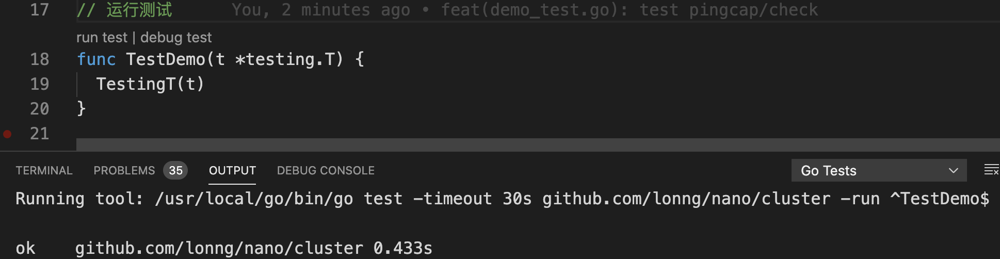

# Nano 内置分布式游戏服务器方案测试用例

## 介绍

### 这是一个系列

1. [探索 Golang 云原生游戏服务器开发，5 分钟上手 Nano 游戏服务器框架](https://juejin.im/post/6870388583019872270)
2. [探索 Golang 云原生游戏服务器开发，根据官方示例实战 Gorilla WebSocket 的用法](https://juejin.im/post/6872641375297339399)

### Nano 分布式游戏服务器方案

Nano包含内置的分布式系统解决方案，可让您轻松创建分布式游戏服务器。

[How to build distributed system with Nano](https://github.com/lonng/nano#how-to-build-distributed-system-with-nano)

### 示例仓库

* 笔者改过后的 Test Case：[node_test.go](https://github.com/Hacker-Linner/nano/blob/master/cluster/node_test.go)

## 开始探索

### 笔者本地环境

```sh
go version
# go version go1.14.2 darwin/amd64
```

### PingCap 测试套件

[pingcap/check](github.com/pingcap/check)

Suite：Suite 将给定的值注册为要运行的测试套件。在给定值中以Test前缀开头的任何方法都将被视为测试方法。

TestingT：TestingT 运行所有用 Suite 函数注册的测试套件，将结果打印到 stdout，并将任何失败报告给 "testing" 包。

新建一个 [`demo_test.go`](https://github.com/Hacker-Linner/nano/blob/master/cluster/demo_test.go)，我们感受一下：

```go
package cluster_test

import (
	"testing"

	. "github.com/pingcap/check"
)

type demoSuite struct{}

var _ = Suite(&demoSuite{})

func (s *demoSuite) TestNodeStartup(c *C) {
	c.Assert(nil, IsNil)
}

// 运行测试
func TestDemo(t *testing.T) {
	TestingT(t)
}
```

如果你是 `VSCode` + `VSCode-GO`，可以直接 `run test`：



### 默认使用 protobuf 进行数据交换

掘金 tag：[protobuf](https://juejin.im/tag/protobuf)，很多掘友会手把手教。

我们可以查看下`benchmark/testdata/test.proto`：

```proto
syntax = "proto3";
package t;

message Ping {
    string Content = 1;
}

message Pong {
    string Content = 2;
}
```

就是按照 protobuf 的规范定义消息，生成相关语言的代码，用来交换数据。

### 测试用例源码分析

```sh
package cluster_test

import (
	"strings"
	"testing"

	"github.com/lonng/nano/benchmark/io"
	"github.com/lonng/nano/benchmark/testdata"
	"github.com/lonng/nano/cluster"
	"github.com/lonng/nano/component"
	"github.com/lonng/nano/scheduler"
	"github.com/lonng/nano/session"
	. "github.com/pingcap/check"
)

type nodeSuite struct{}

// 注册测试套件
var _ = Suite(&nodeSuite{})

type (
	// 定义运行在 Master(主) 服务器上的 Nano 组件
	MasterComponent struct{ component.Base }
	// 定义运行在 Gate(网关) 服务器上的 Nano 组件
	GateComponent struct{ component.Base }
	// 定义运行在 Game(游戏业务逻辑) 服务器上的 Nano 组件
	GameComponent struct{ component.Base }
)

// Master 服务器上名为 `Test` Handler 方法，对外提供服务
func (c *MasterComponent) Test(session *session.Session, _ []byte) error {
	// 推送消息
	return session.Push("test", &testdata.Pong{Content: "master server pong"})
}

// Gate 服务器上名为 `Test` Handler 方法，对外提供服务
func (c *GateComponent) Test(session *session.Session, ping *testdata.Ping) error {
	// 推送消息
	return session.Push("test", &testdata.Pong{Content: "gate server pong"})
}

// Gate 服务器上名为 `Test2` Handler 方法，对外提供服务
func (c *GateComponent) Test2(session *session.Session, ping *testdata.Ping) error {
	// 响应消息
	return session.Response(&testdata.Pong{Content: "gate server pong2"})
}

// Game 服务器上名为 `Test` Handler 方法，对外提供服务
func (c *GameComponent) Test(session *session.Session, _ []byte) error {
	// 推送消息
	return session.Push("test", &testdata.Pong{Content: "game server pong"})
}

// Game 服务器上名为 `Test2` Handler 方法，对外提供服务
func (c *GameComponent) Test2(session *session.Session, ping *testdata.Ping) error {
	return session.Response(&testdata.Pong{Content: "game server pong2"})
}

func TestNode(t *testing.T) {
	TestingT(t)
}

func (s *nodeSuite) TestNodeStartup(c *C) {
	// 开启一个全局的任务调度
	go scheduler.Sched()
	// 结束前清理
	defer scheduler.Close()

	// 注册 Master 服务器的 Components
	masterComps := &component.Components{}
	masterComps.Register(&MasterComponent{})

	// 集群 Master 服务器配置
	masterNode := &cluster.Node{
		// 服务地址
		ServiceAddr: "127.0.0.1:4450",
	}
	masterNode.Options = cluster.Options{
		IsMaster:   true,        // 设定为 Master Node
		Components: masterComps, // 设置 Master Components
	}

	// 启动 Master 节点服务器
	err := masterNode.Startup()
	// 断言启动是否有错误
	c.Assert(err, IsNil)
	// 断言 LocalService 是否是我们定义的 MasterComponent
	masterHandler := masterNode.Handler()
	c.Assert(masterHandler.LocalService(), DeepEquals, []string{"MasterComponent"})

	// 注册 Gate 服务器节点的 Components
	gateComps := &component.Components{}
	gateComps.Register(&GateComponent{})

	// 网关服务器配置
	gateNode := &cluster.Node{
		// 提供给其它服务远程调用的地址
		ServiceAddr: "127.0.0.1:14451",
	}
	gateNode.Options = cluster.Options{
		// Master 服务器地址
		AdvertiseAddr: "127.0.0.1:4450",
		// Client 连接地址
		ClientAddr: "127.0.0.1:14452",
		// 网关组件
		Components: gateComps,
	}

	// 启动网关服务器
	err = gateNode.Startup()
	// 断言是否有启动错误
	c.Assert(err, IsNil)
	gateHandler := gateNode.Handler()
	// 断言 Master 服务器自身服务
	c.Assert(masterHandler.LocalService(), DeepEquals, []string{"MasterComponent"})
	// 断言 Master 服务器可进行远程调用的服务
	c.Assert(masterHandler.RemoteService(), DeepEquals, []string{"GateComponent"})
	// 断言 Gate 服务器自身服务
	c.Assert(gateHandler.LocalService(), DeepEquals, []string{"GateComponent"})
	// 断言 Gate 服务器可进行远程调用的服务
	c.Assert(gateHandler.RemoteService(), DeepEquals, []string{"MasterComponent"})

	// 注册 Game 服务器的 Components
	gameComps := &component.Components{}
	gameComps.Register(&GameComponent{})

	// 游戏服务器配置
	gameNode := &cluster.Node{
		// 提供给其它服务远程调用的地址
		ServiceAddr: "127.0.0.1:24451",
	}
	gameNode.Options = cluster.Options{
		// Master 服务器地址
		AdvertiseAddr: "127.0.0.1:4450",
		// 游戏服务器组件
		Components: gameComps,
	}

	// 启动游戏服务器
	err = gameNode.Startup()
	// 断言启动是否有错误
	c.Assert(err, IsNil)
	gameHandler := gameNode.Handler()
	// 断言 Master 服务器自身服务
	c.Assert(masterHandler.LocalService(), DeepEquals, []string{"MasterComponent"})
	// 断言 Master 服务器可进行远程调用的服务
	c.Assert(masterHandler.RemoteService(), DeepEquals, []string{"GameComponent", "GateComponent"})
	// 断言 Gate 服务器自身服务
	c.Assert(gateHandler.LocalService(), DeepEquals, []string{"GateComponent"})
	// 断言 Gate 服务器可进行远程调用的服务
	c.Assert(gateHandler.RemoteService(), DeepEquals, []string{"GameComponent", "MasterComponent"})
	// 断言 Game 服务器自身服务
	c.Assert(gameHandler.LocalService(), DeepEquals, []string{"GameComponent"})
	// 断言 Game 服务器可进行远程调用的服务
	c.Assert(gameHandler.RemoteService(), DeepEquals, []string{"GateComponent", "MasterComponent"})

	// 新建一个连接器
	connector := io.NewConnector()

	// 创建一个等待连接成功的 channel
	chWait := make(chan struct{})
	connector.OnConnected(func() {
		// 触发等待连接成功的 channel
		chWait <- struct{}{}
	})

	// 连接到网关服务器
	if err := connector.Start("127.0.0.1:14452"); err != nil {
		// 断言一下是否有连接错误
		c.Assert(err, IsNil)
	}
	// 订阅等待连接成功的 channel
	<-chWait

	// 创建一个订阅服务器消息的 channel
	onResult := make(chan string)
	// 订阅一下来自服务器的 Push
	connector.On("test", func(data interface{}) {
		onResult <- string(data.([]byte))
	})
	// 通知 Gate 服务器的 Test 服务
	err = connector.Notify("GateComponent.Test", &testdata.Ping{Content: "ping"})
	c.Assert(err, IsNil)
	// 断言服务器返回结果
	c.Assert(strings.Contains(<-onResult, "gate server pong"), IsTrue)

	// 通知 Game 服务器的 Test 服务
	err = connector.Notify("GameComponent.Test", &testdata.Ping{Content: "ping"})
	c.Assert(err, IsNil)
	c.Assert(strings.Contains(<-onResult, "game server pong"), IsTrue)

	// 请求 Gate 服务器的 Test2 服务
	err = connector.Request("GateComponent.Test2", &testdata.Ping{Content: "ping"}, func(data interface{}) {
		onResult <- string(data.([]byte))
	})
	c.Assert(err, IsNil)
	c.Assert(strings.Contains(<-onResult, "gate server pong2"), IsTrue)

	// 请求 Game 服务器的 Test2 服务
	err = connector.Request("GameComponent.Test2", &testdata.Ping{Content: "ping"}, func(data interface{}) {
		onResult <- string(data.([]byte))
	})
	c.Assert(err, IsNil)
	c.Assert(strings.Contains(<-onResult, "game server pong2"), IsTrue)

	// 通知 Master 服务器的 Test 服务
	err = connector.Notify("MasterComponent.Test", &testdata.Ping{Content: "ping"})
	c.Assert(err, IsNil)
	c.Assert(strings.Contains(<-onResult, "master server pong"), IsTrue)
}
```

### 小结

通过示例，我们知道服务器有三种：`主服务器`，`网关服务器` ，`游戏业务逻辑服务器`。

启动服务器，一般会有如下操作：
* 定义组件 `struct Comp { component.Base }`
* 注册组件 `components.Register(Comp)`
* 设置服务器启动选项 `&cluster.Node{}`
* 启动服务器 `node.Startup()`
