# 硬核实战之调试 NanoServer 生产级麻将🀄️游戏服务器

## 介绍

### 这是一个系列

1. [探索 Golang 云原生游戏服务器开发，5 分钟上手 Nano 游戏服务器框架](https://juejin.im/post/6870388583019872270)
2. [探索 Golang 云原生游戏服务器开发，根据官方示例实战 Gorilla WebSocket 的用法](https://juejin.im/post/6872641375297339399)
3. [探索 Golang 云原生游戏服务器开发，Nano 内置分布式游戏服务器方案测试用例](https://juejin.im/post/6877028133116706823)
4. [探索 Golang 云原生游戏服务器开发，Nano 分布式(集群)示例(Distributed Chat)](https://juejin.im/post/6878706308682350605)

### 示例仓库

* 官方仓库：[nanoserver](https://github.com/lonng/nanoserver)
* 为方便使用 Docker Compose 进行二次开发，笔者改过的仓库：[Hacker-Linner/nanoserver](https://github.com/Hacker-Linner/nanoserver)

## 服务器

### 编写 Dockerfile.dev

```dockerfile
FROM golang:1.14

WORKDIR /workspace

# 阿里云
RUN go env -w GO111MODULE=on
RUN go env -w GOPROXY=https://mirrors.aliyun.com/goproxy/,direct

# debug
RUN go get github.com/go-delve/delve/cmd/dlv

# live reload
RUN go get -u github.com/cosmtrek/air

# copy modules manifests
COPY go.mod go.mod
COPY go.sum go.sum

# cache modules
RUN go mod download
```

### 构建本地开发 Image

```sh
docker build -f Dockerfile.dev -t scmj-server:dev .
```

### 编写 mysql.cnf

```yaml
[client]
port = 3306
socket = /var/run/mysqld/mysql.sock
default-character-set = utf8mb4

[mysql]
prompt="MySQL [\d]> "
no-auto-rehash

[mysqld]
port = 3306
socket = /var/run/mysqld/mysql.sock

basedir = /usr/local/mysql
datadir = /var/lib/mysql
pid-file = /var/run/mysqld/mysql.pid
user = mysql
bind-address = 0.0.0.0
server-id = 1

init-connect = 'SET NAMES utf8mb4'
character-set-server = utf8mb4

skip-name-resolve
#skip-networking
back_log = 300

max_connections = 497
max_connect_errors = 6000
open_files_limit = 65535
table_open_cache = 128
max_allowed_packet = 500M
binlog_cache_size = 1M
max_heap_table_size = 8M
tmp_table_size = 16M

read_buffer_size = 2M
read_rnd_buffer_size = 8M
sort_buffer_size = 8M
join_buffer_size = 8M
key_buffer_size = 4M

thread_cache_size = 8

query_cache_type = 1
query_cache_size = 8M
query_cache_limit = 2M

ft_min_word_len = 4

log_bin = mysql-bin
binlog_format = mixed
expire_logs_days = 7

log_error = /var/lib/mysql/mysql-error.log
slow_query_log = 1
long_query_time = 1
slow_query_log_file = /var/lib/mysql/mysql-slow.log
general_log = 1
general_log_file = /var/lib/mysql/mysql.log

performance_schema = 0
explicit_defaults_for_timestamp

#lower_case_table_names = 1

skip-external-locking

default_storage_engine = InnoDB
innodb_file_per_table = 1
innodb_open_files = 500
innodb_buffer_pool_size = 64M
innodb_write_io_threads = 4
innodb_read_io_threads = 4
innodb_thread_concurrency = 0
innodb_purge_threads = 1
innodb_flush_log_at_trx_commit = 2
innodb_log_buffer_size = 2M
innodb_log_file_size = 32M
innodb_log_files_in_group = 3
innodb_max_dirty_pages_pct = 90
innodb_lock_wait_timeout = 120

bulk_insert_buffer_size = 8M
myisam_sort_buffer_size = 8M
myisam_max_sort_file_size = 10G
myisam_repair_threads = 1

interactive_timeout = 28800
wait_timeout = 28800

[mysqldump]
quick
max_allowed_packet = 500M

[myisamchk]
key_buffer_size = 8M
sort_buffer_size = 8M
read_buffer = 4M
write_buffer = 4M
```

### 编写 docker-compose.mysql.yaml

```yaml
version: "3.7"
services:
  db:
    image: mysql:5.7
    volumes:
      - db_data:/var/lib/mysql
      - ./mysql.cnf:/etc/mysql/my.cnf
    networks:
      - db_network
    ports:
      - "3306:3306"
    restart: always
    environment:
      MYSQL_ROOT_PASSWORD: 123456
      MYSQL_DATABASE: scmj
      MYSQL_USER: scmj
      MYSQL_PASSWORD: scmj
      TZ: Asia/Shanghai

  adminer:
    depends_on:
      - db
    image: adminer
    restart: always
    networks:
      - db_network
    ports:
      - 8086:8080

networks:
  db_network:
    driver: "bridge"

volumes:
    db_data: {}
```

### 一键启动 MySql 和 Adminer

```sh
docker-compose -f docker-compose.mysql.yaml up -d
```

### 登录 Adminer 管理界面

我们进入 [http://localhost:8086](http://localhost:8086)，使用如下配置登录：
* 系统：`MySQL`
* 服务器：`db`
* 用户名：`root`
* 密码：`123456`
* 数据库：`scmj`

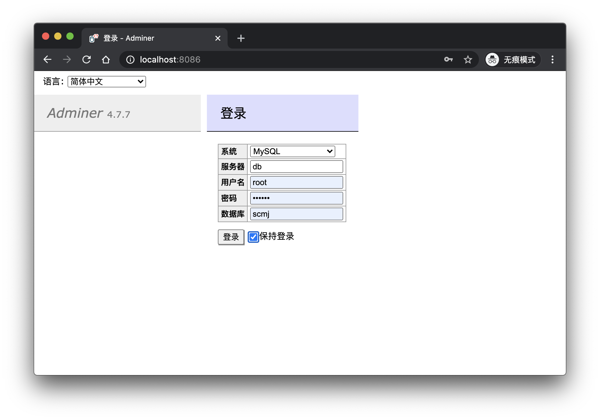

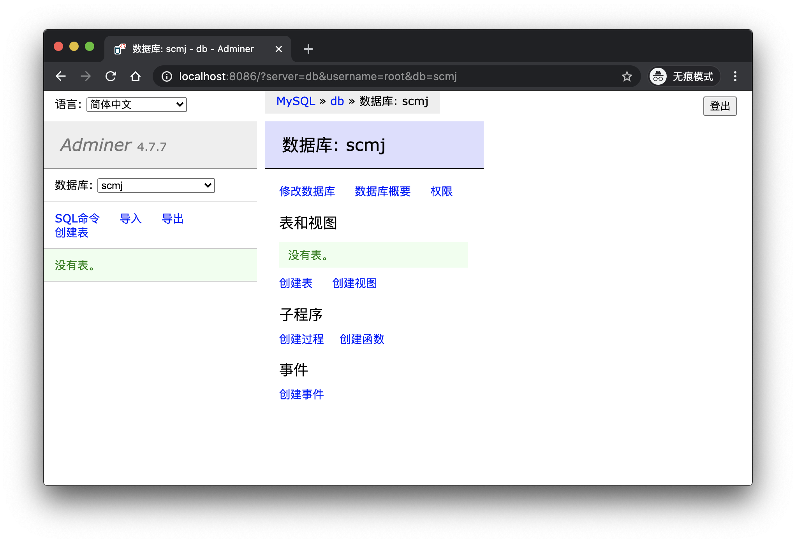

### 加入 launch.json

方便 VSCode 调试

```json
{
  // 使用 IntelliSense 了解相关属性。 
  // 悬停以查看现有属性的描述。
  // 欲了解更多信息，请访问: https://go.microsoft.com/fwlink/?linkid=830387
  "version": "0.2.0",
  "configurations": [
      {
          "name": "nanoserver",
          "type": "go",
          "request": "launch",
          "mode": "remote",
          "remotePath":"/workspace/app",
          "port": 2345,
          "program": "${workspaceFolder}",
          "env": {
              "GO111MODULE":"on"
          },
          "args": [],
          "trace": "log",
          "showLog": true
      }
  ]
}
```

### 加入 .air.toml

```toml
# Config file for [Air](https://github.com/cosmtrek/air) in TOML format

# Working directory
# . or absolute path, please note that the directories following must be under root.
root = "."
tmp_dir = "tmp"

[build]
# Just plain old shell command. You could use `make` as well.
cmd = "go build -o ./tmp/main ."
# Binary file yields from `cmd`.
bin = "tmp/main"
# Customize binary.
full_bin = "APP_ENV=dev APP_USER=air ./tmp/main"
# Watch these filename extensions.
include_ext = ["go", "tpl", "tmpl", "html"]
# Ignore these filename extensions or directories.
exclude_dir = ["assets", "tmp", "vendor", "frontend/node_modules"]
# Watch these directories if you specified.
include_dir = []
# Exclude files.
exclude_file = []
# This log file places in your tmp_dir.
log = "air.log"
# It's not necessary to trigger build each time file changes if it's too frequent.
delay = 1000 # ms
# Stop running old binary when build errors occur.
stop_on_error = true
# Send Interrupt signal before killing process (windows does not support this feature)
send_interrupt = false
# Delay after sending Interrupt signal
kill_delay = 500 # ms

[log]
# Show log time
time = false

[color]
# Customize each part's color. If no color found, use the raw app log.
main = "magenta"
watcher = "cyan"
build = "yellow"
runner = "green"

[misc]
# Delete tmp directory on exit
clean_on_exit = true
```

### 编写 docker-compose.dev.yaml

```sh
version: "3.4"
services:

  scmj:
    image: scmj-server:dev
    command: >
      bash -c "cp ./go.mod ./go.sum app/
      && cd app/
      && ls -la
      && air -c .air.toml -d"
    volumes:
    - ./:/workspace/app
    networks:
      - db_network
    ports:
      - 12307:12307
      - 33251:33251
  
  scmj-debug:
    image: scmj-server:dev
    command: >
      bash -c "cp ./go.mod ./go.sum app/
      && cd app/
      && ls -la
      && dlv debug main.go --headless --log -l 0.0.0.0:2345 --api-version=2"
    volumes:
    - ./:/workspace/app
    networks:
      - db_network
    ports:
      - 12307:12307
      - 33251:33251
      - 2345:2345
    security_opt:
      - "seccomp:unconfined"

networks:
  db_network:
    driver: "bridge"
```

### 使用 docker-compose 调试

```sh
docker-compose -f docker-compose.dev.yaml up scmj-debug
```

### 使用 docker-compose 开发

```sh
docker-compose -f docker-compose.dev.yaml up scmj
```

因为 [nanoserver](https://github.com/lonng/nanoserver) 使用了 [xorm](https://gitea.com/xorm/xorm)，它会自动的根据定义的 `model` 生成数据库表 `schema`。

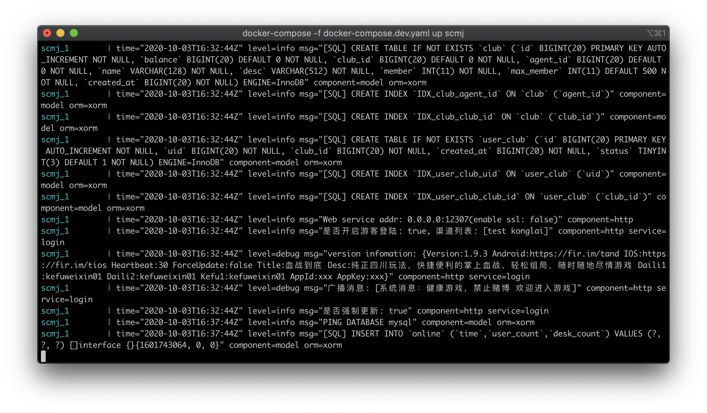

### XORM 同步数据库

重新查看 Adminer，发现在 `scmj` 数据库中，[xorm](https://gitea.com/xorm/xorm) 已经为我们生成了表。

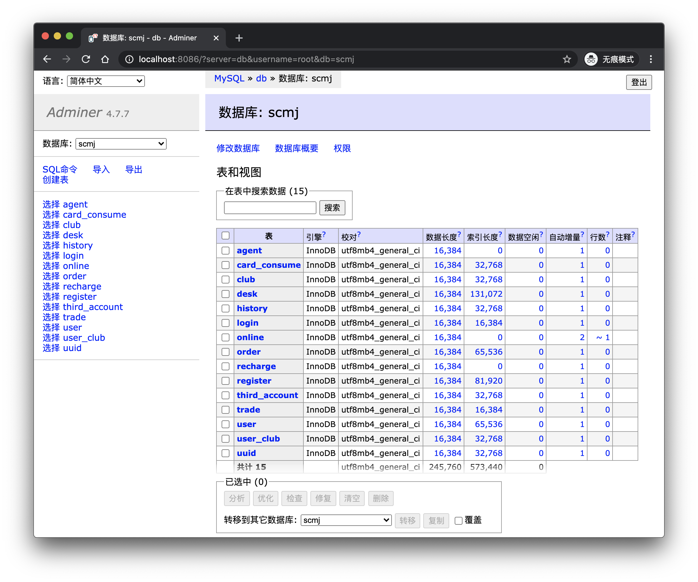

相关代码是：
```go
....
func syncSchema() {
	database.StoreEngine("InnoDB").Sync2(
		new(model.Agent),
		new(model.CardConsume),
		new(model.Desk),
		new(model.History),
		new(model.Login),
		new(model.Online),
		new(model.Order),
		new(model.Recharge),
		new(model.Register),
		new(model.ThirdAccount),
		new(model.Trade),
		new(model.User),
		new(model.Uuid),
		new(model.Club),
		new(model.UserClub),
	)
}
...
```

## 客户端

这里我们直接使用 [nanoserver](https://github.com/lonng/nanoserver) 作者提供的 `apk`。

### 安装安卓模拟器

这里我推荐网易的 [MuMu模拟器](https://mumu.163.com/)。


### 安装 APK

[mahjong.apk](https://github.com/Hacker-Linner/nanoserver/mahjong.apk)，已经放到笔者修改过的项目中。这里我们使用多开助手，开4个空来血战。

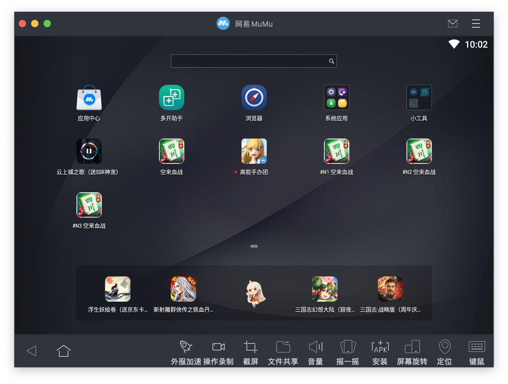


### 客户端登录

我们点击微信登录。


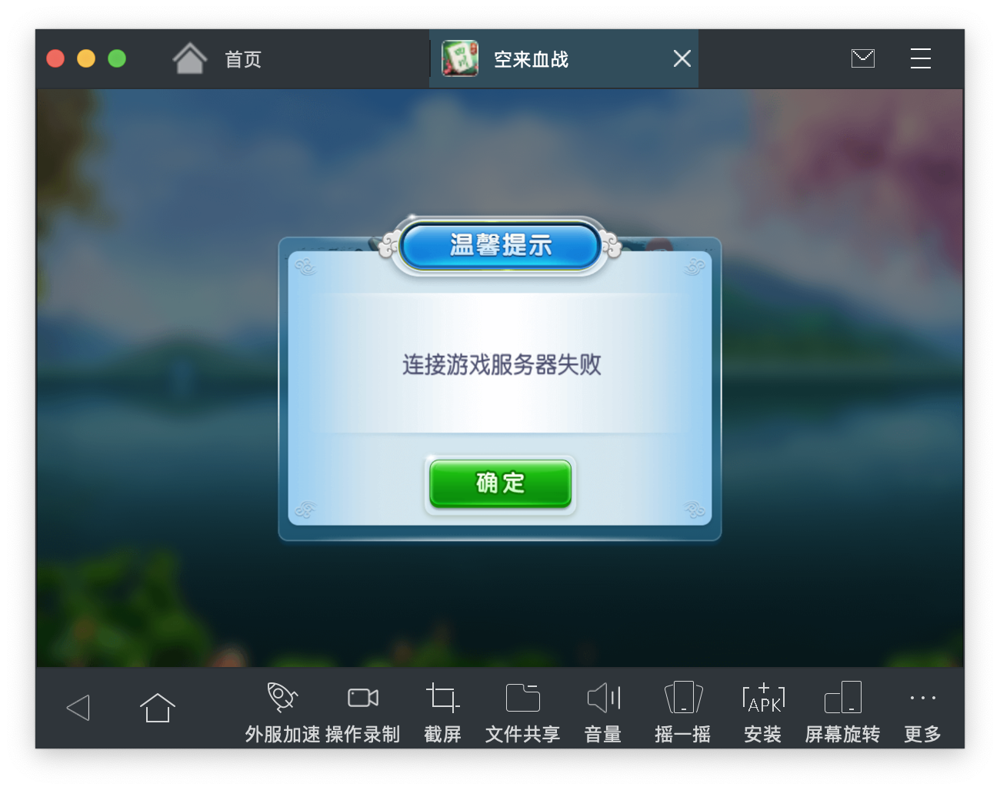

发现登录失败……

### 解决客户端登录失败问题

当然这问题，也好解决：

1. 按作者所说那样，反编译 `apk`，找到 `appConfig.luac`，使用二进制编辑器改完服务器地址，然后重新打包。

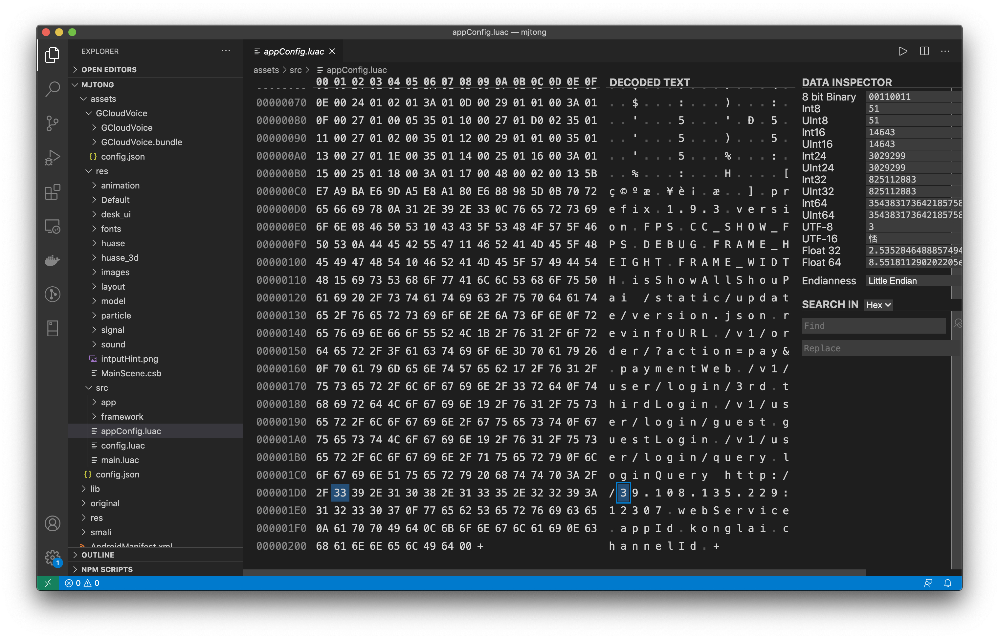

2. 直接使用代理，如 `Charles` 进行请求地址转发。（本地调试服务器程序完全够了）

### Charles 对客户端请求地址转发

使用 `Map Remote` 映射到你本机调试的地址就完全够了。

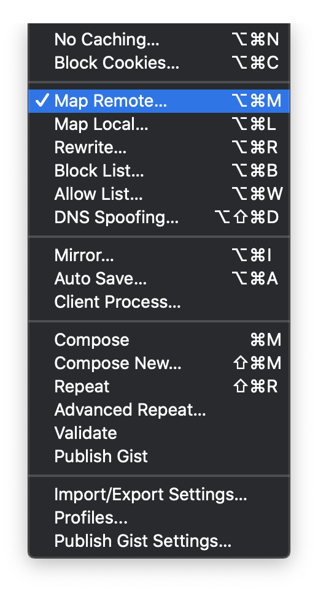


### 加入 guest 测试渠道 konglai

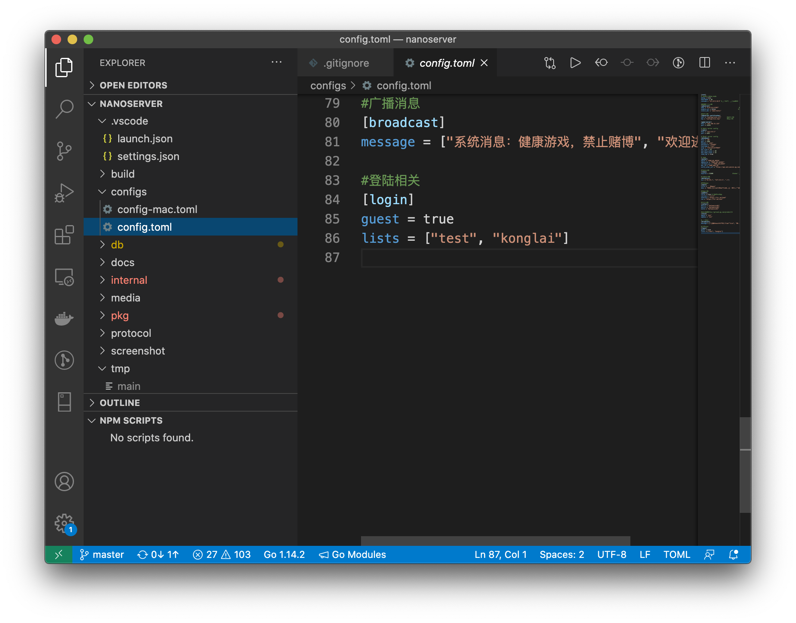

### 重新登录进入游戏


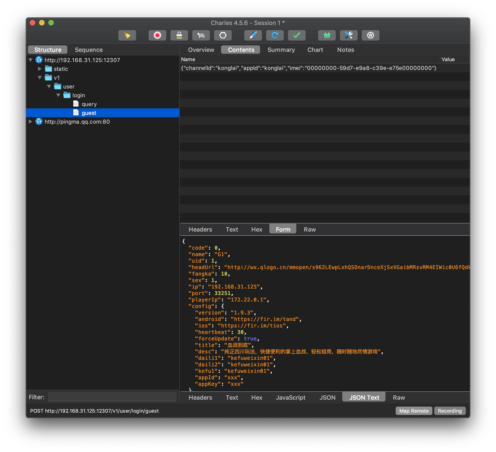

完美，搞定。

## 测试并凑一局血战到底

### 创建房间


### 加入房间


### 开始游戏


### 查看服务器日志

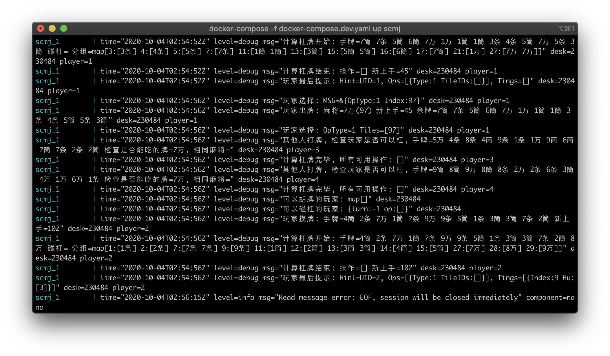